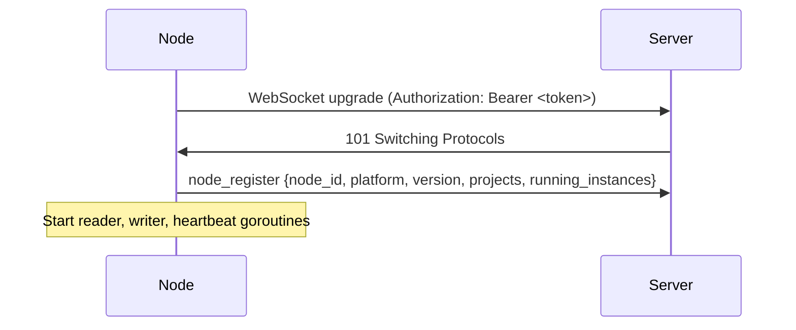
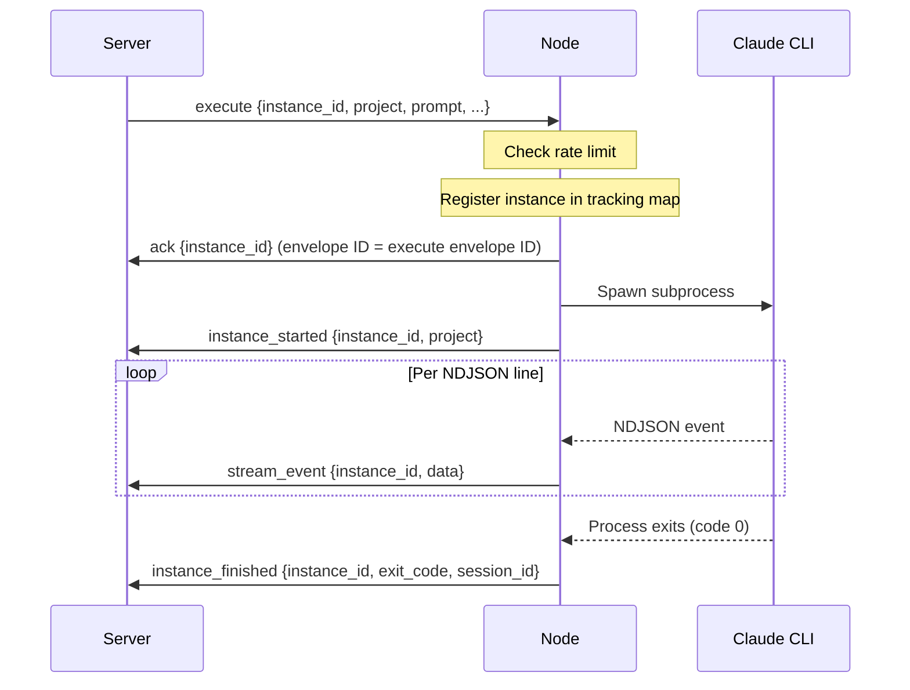
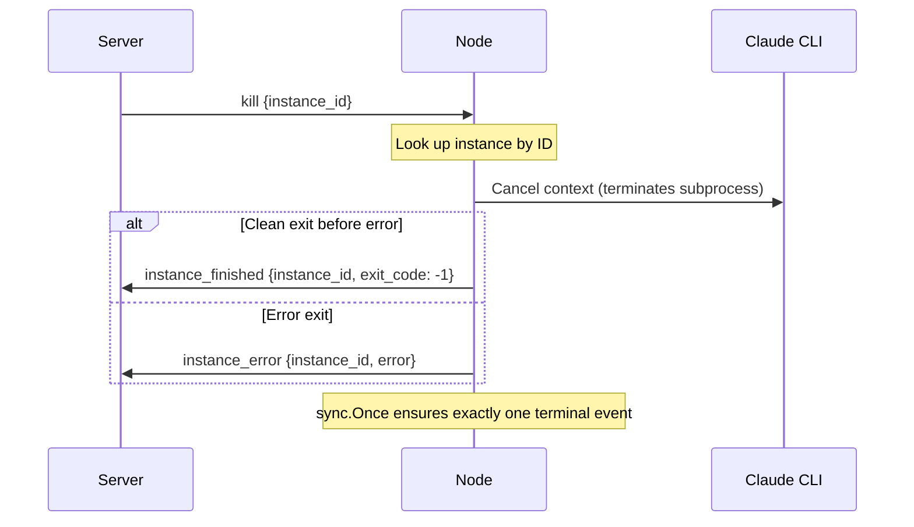
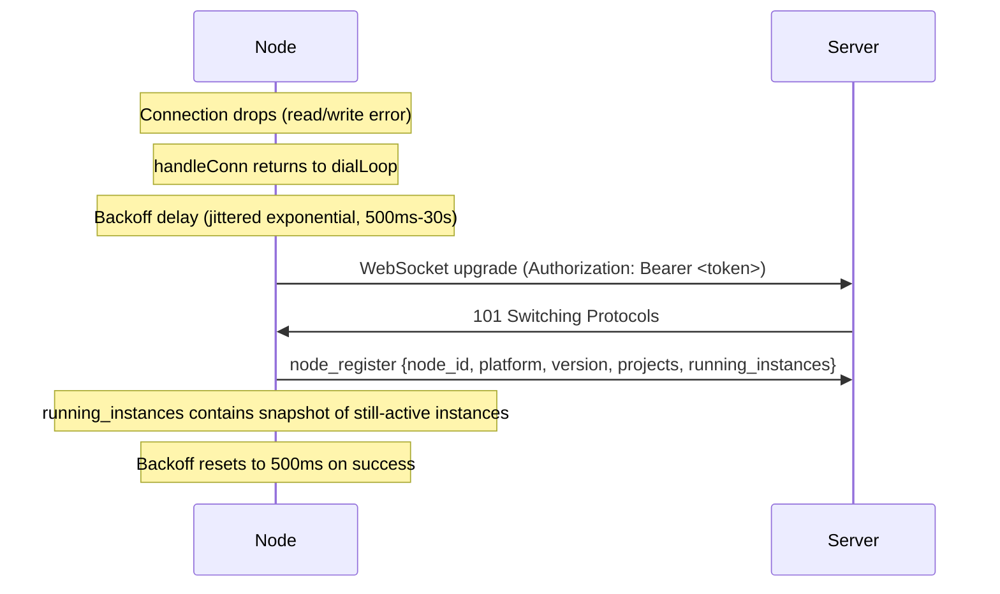
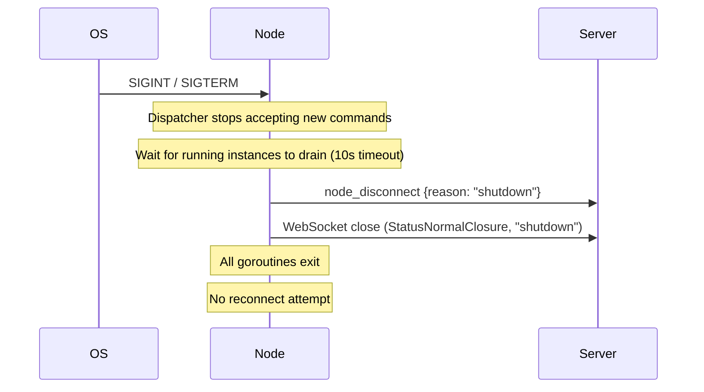

# GSD Node Wire Protocol Specification

**Protocol Version:** 1.2.0
**Status:** Normative -- derived from working node implementation
**Source of truth:** `internal/protocol/messages.go`, `internal/connection/`, `internal/dispatch/dispatcher.go`

---

## 1. Overview

The GSD Node protocol defines a WebSocket-based communication channel between node software and a central server.

- **Protocol version:** `1.2.0` (constant `protocol.Version`)
- **Transport:** WebSocket over TLS (`wss://`)
- **Framing:** JSON text frames. Every message in both directions is wrapped in an Envelope.
- **Direction convention:**
  - **Inbound** = server-to-node (commands the server sends to a node)
  - **Outbound** = node-to-server (events the node sends to the server)
- **Connection direction:** The node connects outbound to the server. Nodes never listen for inbound connections. This eliminates firewall configuration on the node side.

---

## 2. Envelope Format

Every WebSocket text frame contains a single JSON object conforming to the `Envelope` structure.

### Envelope struct

| Field     | JSON key    | Type              | Notes                                                        |
|-----------|-------------|-------------------|--------------------------------------------------------------|
| `Type`    | `"type"`    | `string`          | Message type discriminator (see Section 3)                   |
| `ID`      | `"id"`      | `string`          | Unique message ID. 32-character hex string (16 random bytes) |
| `Payload` | `"payload"` | `object` or omitted | Raw JSON. Omitted (`omitempty`) when payload is empty        |

### Dispatch model

`Payload` is stored as `json.RawMessage`. The receiver inspects `Type` first, then decodes `Payload` into the corresponding struct. This avoids allocating unknown structs for unrecognized types.

### Encode function

`Encode(msgType, msgID string, payload any) (Envelope, error)` -- marshals `payload` to JSON and wraps it in an Envelope.

### Decode method

`Envelope.Decode(dst any) error` -- unmarshals `Payload` into `dst`. Call after inspecting `Type` to select the correct destination struct.

### NewMsgID function

`NewMsgID()` generates a message ID: 16 cryptographically random bytes, hex-encoded to produce a 32-character string. Used for all outbound envelope IDs.

### Example: wrapped message

```json
{
  "type": "node_register",
  "id": "a1b2c3d4e5f60718293a4b5c6d7e8f90",
  "payload": {
    "node_id": "abc123def456",
    "platform": "windows",
    "version": "1.2.0",
    "projects": ["my-project"],
    "running_instances": []
  }
}
```

---

## 3. Message Type Catalog

There are 10 message types. Seven are outbound (node-to-server), three are inbound (server-to-node).

### 3.1 Outbound Messages (node-to-server)

#### 3.1.1 `node_register`

**Type string:** `"node_register"`
**Direction:** Outbound
**When sent:** (1) As the first frame after WebSocket connection is established, before any other goroutines start. (2) In response to a `status_request` command from the server.
**Go struct:** `NodeRegister`

**JSON schema:**

```json
{
  "node_id": "<string>",
  "platform": "<string>",
  "version": "<string>",
  "projects": ["<string>", ...],
  "running_instances": [
    {
      "instance_id": "<string>",
      "project": "<string>",
      "session_id": "<string, optional>"
    }
  ]
}
```

| Field               | JSON type        | Go type              | Notes                                                                                      |
|---------------------|------------------|----------------------|--------------------------------------------------------------------------------------------|
| `node_id`           | `string`         | `string`             | Stable hardware-derived identifier (machine ID hash or hostname SHA-256 fallback)          |
| `platform`          | `string`         | `string`             | Value of `runtime.GOOS` (e.g., `"windows"`, `"linux"`, `"darwin"`)                         |
| `version`           | `string`         | `string`             | Must match `protocol.Version` (`"1.2.0"`)                                                  |
| `projects`          | `array<string>`  | `[]string`           | List of project names configured on this node. Empty array `[]` when none configured.      |
| `running_instances` | `array<object>`  | `[]InstanceSummary`  | **No `omitempty` tag.** Must serialize as `[]` (empty array), never `null`, when no instances are running. Callers must initialize with `make([]InstanceSummary, 0)`. |

**`InstanceSummary` sub-object:**

| Field         | JSON type | Go type  | Notes                                             |
|---------------|-----------|----------|---------------------------------------------------|
| `instance_id` | `string`  | `string` | Server-assigned instance identifier                |
| `project`     | `string`  | `string` | Project name the instance is running under         |
| `session_id`  | `string`  | `string` | Claude session ID. Omitted from JSON when empty (`omitempty`). |

---

#### 3.1.2 `ack`

**Type string:** `"ack"`
**Direction:** Outbound
**When sent:** Immediately after receiving an `execute` command, before spawning the Claude CLI subprocess. The ACK envelope reuses the inbound `execute` envelope's `ID` for correlation.
**Go struct:** `ACK`

**JSON schema:**

```json
{
  "instance_id": "<string>"
}
```

| Field         | JSON type | Go type  | Notes                          |
|---------------|-----------|----------|--------------------------------|
| `instance_id` | `string`  | `string` | Echoes the `execute` command's `instance_id` |

**Correlation:** The ACK envelope's `ID` field is set to the inbound `execute` envelope's `ID`, not a new random ID. This allows the server to match the ACK to the original command.

---

#### 3.1.3 `stream_event`

**Type string:** `"stream_event"`
**Direction:** Outbound
**When sent:** Once per NDJSON line emitted by the Claude CLI subprocess. Repeated for the duration of the instance's execution.
**Go struct:** `StreamEvent`

**JSON schema:**

```json
{
  "instance_id": "<string>",
  "data": "<string>"
}
```

| Field         | JSON type | Go type  | Notes                                                   |
|---------------|-----------|----------|---------------------------------------------------------|
| `instance_id` | `string`  | `string` | Identifies which running instance produced this output   |
| `data`        | `string`  | `string` | A single NDJSON line from Claude CLI, JSON-encoded as a string |

**Note:** `data` contains a JSON-serialized `ClaudeEvent` object as a string. The server must parse `data` as JSON to extract structured event information.

---

#### 3.1.4 `instance_started`

**Type string:** `"instance_started"`
**Direction:** Outbound
**When sent:** When the Claude CLI subprocess has been launched successfully (after process creation, before streaming begins).
**Go struct:** `InstanceStarted`

**JSON schema:**

```json
{
  "instance_id": "<string>",
  "project": "<string>",
  "session_id": "<string, optional>"
}
```

| Field         | JSON type | Go type  | Notes                                                     |
|---------------|-----------|----------|-----------------------------------------------------------|
| `instance_id` | `string`  | `string` | The server-assigned instance identifier                    |
| `project`     | `string`  | `string` | Project name the instance is running under                 |
| `session_id`  | `string`  | `string` | Claude session ID if resuming. Omitted when empty (`omitempty`). |

---

#### 3.1.5 `instance_finished`

**Type string:** `"instance_finished"`
**Direction:** Outbound
**When sent:** When the Claude CLI subprocess exits cleanly (no error, or context cancellation due to kill with clean exit).
**Go struct:** `InstanceFinished`

**JSON schema:**

```json
{
  "instance_id": "<string>",
  "exit_code": 0,
  "session_id": "<string, optional>"
}
```

| Field         | JSON type | Go type | Notes                                        |
|---------------|-----------|---------|----------------------------------------------|
| `instance_id` | `string`  | `string`| Identifies the instance that finished         |
| `exit_code`   | `number`  | `int`   | Real OS exit code from the Claude CLI process. 0 = clean exit, -1 = killed by signal, positive = CLI error code. |
| `session_id`  | `string`  | `string`| Claude session ID from this run. Omitted when empty (omitempty). Server should store this for use as `session_id` in future `execute` commands. |

---

#### 3.1.6 `instance_error`

**Type string:** `"instance_error"`
**Direction:** Outbound
**When sent:** (1) When the Claude CLI subprocess exits with a non-context error. (2) When the node rejects an `execute` command due to rate limiting (error: `"rate limited"`). (3) When process creation fails.
**Go struct:** `InstanceError`

**JSON schema:**

```json
{
  "instance_id": "<string>",
  "error": "<string>"
}
```

| Field         | JSON type | Go type  | Notes                                                |
|---------------|-----------|----------|------------------------------------------------------|
| `instance_id` | `string`  | `string` | Identifies the instance that errored                  |
| `error`       | `string`  | `string` | Human-readable error description                      |

**Terminal event guarantee:** For any given instance, exactly one of `instance_finished` or `instance_error` will be emitted. A `sync.Once` gate prevents both from firing (e.g., when a kill races with natural exit).

---

#### 3.1.7 `node_disconnect`

**Type string:** `"node_disconnect"`
**Direction:** Outbound
**When sent:** Before a clean WebSocket close during graceful shutdown. The writer goroutine sends this as its final action before calling `conn.Close()`.
**Go struct:** `NodeDisconnect`

**JSON schema:**

```json
{
  "reason": "<string, optional>"
}
```

| Field    | JSON type | Go type  | Notes                                                     |
|----------|-----------|----------|-----------------------------------------------------------|
| `reason` | `string`  | `string` | Reason for disconnection. Omitted when empty (`omitempty`). Currently always `"shutdown"` for clean shutdown. |

---

### 3.2 Inbound Messages (server-to-node)

#### 3.2.1 `execute`

**Type string:** `"execute"`
**Direction:** Inbound
**When sent:** Server instructs the node to start a new Claude CLI instance.
**Go struct:** `ExecuteCmd`

**JSON schema:**

```json
{
  "instance_id": "<string>",
  "project": "<string>",
  "work_dir": "<string>",
  "prompt": "<string>",
  "session_id": "<string, optional>"
}
```

| Field         | JSON type | Go type  | Notes                                                     |
|---------------|-----------|----------|-----------------------------------------------------------|
| `instance_id` | `string`  | `string` | Server-assigned unique identifier for this execution       |
| `project`     | `string`  | `string` | Project name configured on the node                        |
| `work_dir`    | `string`  | `string` | Working directory for the Claude CLI subprocess            |
| `prompt`      | `string`  | `string` | User message to send to Claude                             |
| `session_id`  | `string`  | `string` | Claude session to resume. Omitted to start new session (`omitempty`). |

**Node behavior on receipt:**
1. Check rate limit for the project. If rate limited, send `instance_error` with `"rate limited"` and stop.
2. Register instance in internal tracking map (before any async work).
3. Send `ack` using the inbound envelope's `ID` for correlation.
4. Spawn instance goroutine which emits `instance_started`, `stream_event`*, and terminal event.

---

#### 3.2.2 `kill`

**Type string:** `"kill"`
**Direction:** Inbound
**When sent:** Server instructs the node to terminate a running Claude CLI instance.
**Go struct:** `KillCmd`

**JSON schema:**

```json
{
  "instance_id": "<string>"
}
```

| Field         | JSON type | Go type  | Notes                              |
|---------------|-----------|----------|------------------------------------|
| `instance_id` | `string`  | `string` | Identifies the running instance to kill |

**Node behavior on receipt:**
1. Look up instance by `instance_id`.
2. If not found, log warning and ignore.
3. If found, cancel the instance's context. This causes the Claude CLI subprocess to be terminated.
4. The instance goroutine emits either `instance_error` or `instance_finished` (whichever fires first through the `sync.Once` gate).

---

#### 3.2.3 `status_request`

**Type string:** `"status_request"`
**Direction:** Inbound
**When sent:** Server requests the node's current state.
**Go struct:** `StatusRequest`

**JSON schema:**

```json
{}
```

Empty payload -- no fields.

**Node behavior on receipt:** Send a `node_register` message with the current node state (including all running instances). The response envelope's `ID` is set to the inbound `status_request` envelope's `ID` for correlation.

---

## 4. Authentication Handshake

### Token-based authentication

Authentication occurs during the WebSocket HTTP upgrade request, not in the protocol layer.

1. **Token source:** `SERVER_TOKEN` environment variable, loaded into `NodeConfig.ServerToken`.
2. **Delivery:** The node sets an HTTP `Authorization` header during WebSocket dial:
   ```
   Authorization: Bearer <SERVER_TOKEN>
   ```
3. **Server URL:** `SERVER_URL` environment variable, loaded into `NodeConfig.ServerURL`. Must be a `wss://` URL for production.

### Server-side validation

The server MUST validate the Bearer token during the HTTP upgrade handshake. To reject a node:
- Return HTTP `401 Unauthorized` (invalid/missing token)
- Return HTTP `403 Forbidden` (valid token but not authorized)

The WebSocket connection is NOT established if the upgrade fails.

### First frame after connection

After the WebSocket connection is established, the node sends a `node_register` message as the **first frame**, synchronously (written directly to the connection, not via the send channel). This happens before the reader, writer, and heartbeat goroutines start.

The server should treat the first `node_register` as the node announcing itself. If the node does not send `node_register` as its first frame, the server may close the connection.

---

## 5. Connection Lifecycle

### Dial

The node dials the server using:

```
websocket.Dial(ctx, serverURL, opts)
```

where `opts` includes the `Authorization: Bearer <token>` header and optionally a custom HTTP client (for TLS configuration).

### Successful connection

On successful dial:
1. Send `node_register` synchronously (direct write, not via send channel)
2. Start three goroutines: **reader**, **writer**, **heartbeat**
3. Wait for all three goroutines to exit (via `sync.WaitGroup`)

### Dial failure

On dial failure, the node applies exponential backoff with full jitter (AWS algorithm):

| Parameter   | Value         |
|-------------|---------------|
| Base (min)  | 500ms         |
| Cap (max)   | 30s           |
| Algorithm   | Full Jitter: `sleep = random_between(0, min(cap, base * 2^attempt))` |
| Progression | Current doubles each attempt: 500ms, 1s, 2s, 4s, 8s, 16s, 30s, 30s, ... |
| Jitter      | Actual delay is `random_between(0, current)` -- uniformly distributed |
| Reset       | Current resets to base (500ms) on successful connection |

The node checks for stop signals between each backoff delay, allowing clean shutdown during reconnection.

### Connection drop

When a read or write error occurs (connection drops), the current `handleConn` returns to the dial loop. The backoff state persists across reconnection attempts within the same dial loop iteration. On successful reconnection, backoff resets.

### Clean shutdown

Clean shutdown follows this sequence:
1. Node receives `SIGINT`/`SIGTERM` (or programmatic stop)
2. Dispatcher stops accepting new commands
3. Node waits for running instances to drain (10-second timeout)
4. Writer goroutine detects stop signal
5. Writer sends `node_disconnect` frame (with 3-second write timeout using a fresh context)
6. Writer sends WebSocket close frame (`StatusNormalClosure`, reason: `"shutdown"`)
7. Reader and heartbeat goroutines exit (connection closed)
8. Dial loop detects stop signal and exits without reconnecting
9. `Stop()` returns after all goroutines complete

**No reconnect after stop signal.** Once `Stop()` is called, the node will never attempt to reconnect.

---

## 6. Heartbeat

The heartbeat mechanism uses WebSocket ping/pong frames (not application-level messages).

| Parameter     | Value                                                        |
|---------------|--------------------------------------------------------------|
| Interval      | Configurable via `HEARTBEAT_INTERVAL_SECS` env var. Default: **30 seconds**. |
| Pong timeout  | **3x interval** (default: 90 seconds)                        |
| Mechanism     | `conn.Ping(ctx)` with a timeout context                      |

### Behavior

1. A dedicated heartbeat goroutine runs a ticker at the configured interval.
2. On each tick, it sends a WebSocket ping frame with a timeout of 3x the interval.
3. If the pong is not received within the timeout, the heartbeat goroutine cancels the connection context, triggering reconnection.
4. On normal tick with successful pong, the cycle continues.

### Important note

The `coder/websocket` library requires an active reader goroutine for pong handling. The reader goroutine must be running before the heartbeat goroutine sends pings. The node's `handleConn` starts both concurrently.

---

## 7. Sequence Diagrams

### Diagram 1: Connection Establishment



### Diagram 2: Execute-Stream-Finish Flow



### Diagram 3: Kill Flow



### Diagram 4: Reconnect Flow



### Diagram 5: Clean Shutdown



---

## 8. Concurrency Model

The node uses four concurrent goroutines per active connection, plus one goroutine per running Claude CLI instance.

### Per-connection goroutines

| Goroutine     | Responsibility                                                                 |
|---------------|--------------------------------------------------------------------------------|
| **Writer**    | Sole caller of `conn.Write()` for normal frames. Drains `sendCh` (buffered 64). Sends `node_disconnect` and close frame on clean shutdown. |
| **Reader**    | Reads frames from the WebSocket. Decodes each frame as an `Envelope`. Forwards to `recvCh` (buffered 64) via non-blocking send. Required for pong handling. |
| **Heartbeat** | Sends periodic `conn.Ping()` on its own ticker. Cancels connection context on pong timeout. |
| **Dispatcher**| Reads from `recvCh`. Routes commands to handlers. Spawns per-instance goroutines. |

### Write serialization

All outbound frames go through the `sendCh` channel (buffered capacity: 64) to the single writer goroutine. This prevents concurrent writes to the WebSocket connection.

**Exception:** The `node_register` frame on initial connection is written directly to the connection (bypassing `sendCh`) because it is sent before the writer goroutine starts.

### Receive channel behavior

The reader goroutine forwards decoded envelopes to `recvCh` (buffered capacity: 64) using a **non-blocking send**. If `recvCh` is full, the inbound envelope is dropped and a warning is logged. This prevents the reader goroutine from stalling, which would block pong handling and cause false heartbeat timeouts.

### Per-instance goroutines

Each `execute` command spawns one goroutine that:
1. Sends `instance_started`
2. Runs the Claude CLI subprocess
3. Streams output as `stream_event` messages
4. Sends exactly one terminal event (`instance_finished` or `instance_error`) via `sync.Once`
5. Removes itself from the instance tracking map

---

## 9. Error Handling

| Scenario                    | Node behavior                                                                 |
|-----------------------------|-------------------------------------------------------------------------------|
| **Rate-limited execute**    | Immediate `instance_error` with error `"rate limited"`. No instance spawned, no ACK sent. |
| **Unknown command type**    | Logged at warn level and ignored. No response sent to server.                 |
| **Malformed envelope**      | Logged at warn level and skipped. No response sent to server.                 |
| **Execute decode failure**  | Logged at error level. No ACK or instance spawned.                            |
| **Kill decode failure**     | Logged at error level. No action taken.                                       |
| **Kill for unknown instance** | Logged at warn level. No response sent.                                     |
| **Claude CLI spawn failure**| `instance_error` sent with the error message. Instance removed from tracking. |
| **Stream error (non-context)** | `instance_error` sent with the error message.                              |
| **Write failure**           | Logged. Connection will drop and trigger reconnect via the reader goroutine.  |
| **recvCh full**             | Inbound envelope dropped. Warning logged with the envelope's type.            |
| **Send after Stop()**       | Returns `ErrStopped` immediately. Frame is not queued.                        |
